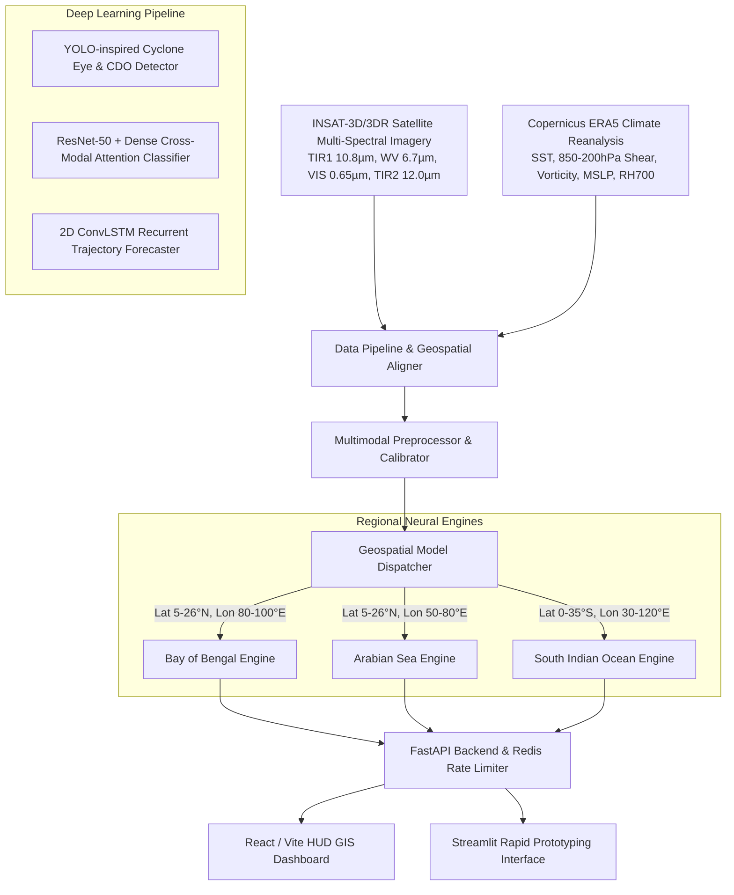

# 🌪️ Tropical Cyclone AI Prediction & Geospatial Tracking System

[](https://fastapi.tiangolo.com)
[](https://pytorch.org)
[](https://onnxruntime.ai)
[](https://reactjs.org)
[](LICENSE)

An end-to-end, multimodal deep learning and operational meteorological tracking platform designed for tropical cyclone **Eye Detection**, **IMD Intensity Scale Classification**, and **48-Hour Spatiotemporal Trajectory Forecasting** across the **Bay of Bengal (BOB)**, **Arabian Sea (ARB)**, and **South Indian Ocean (SIO)**.

---

## 🌟 System Architecture



---

## 📁 Repository Structure

```
tropical_cyclone_project/
│
├── data/
│   ├── raw/
│   │   ├── satellite_imagery/          # INSAT-3D, NOAA, NASA MODIS raw feeds
│   │   └── climate_reanalysis/         # ERA5 NetCDF/GRIB (SST, wind shear, vorticity)
│   ├── processed/
│   │   ├── bay_of_bengal/              # Geographically segregated datasets
│   │   ├── arabian_sea/
│   │   └── indian_ocean_south/
│   └── annotations/                    # Bounding boxes and IMD intensity labels
│
├── notebooks/
│   ├── 01_satellite_eda.ipynb          # Satellite channel calibration & eye cross-sections
│   ├── 02_multimodal_fusion_experiments.ipynb # ResNet-50 + Dense fusion ablation study
│   └── 03_spatiotemporal_tracking.ipynb       # ConvLSTM 48h trajectory & uncertainty cone
│
├── src/
│   ├── data_pipeline/
│   │   ├── fetch_mosdac_insat.py       # ISRO MOSDAC API integration
│   │   ├── fetch_copernicus_era5.py    # Copernicus CDS API integration
│   │   ├── fetch_nasa_earthdata.py     # NASA CMR API integration
│   │   ├── fetch_openmeteo.py          # Open-Meteo marine/weather API
│   │   ├── spatial_aligner.py          # Aligns 2D pixel grids with 3D weather tensors
│   │   └── preprocessor.py             # Denoising, band stacking, normalization
│   ├── models/
│   │   ├── identification.py           # YOLOv8-inspired object detection model
│   │   ├── classification_fusion.py    # ResNet-50 + Dense multimodal fusion model
│   │   ├── prediction_convlstm.py      # ConvLSTM spatio-temporal trajectory model
│   │   └── model_dispatcher.py         # Dynamic routing logic based on coordinates
│   ├── training/
│   │   ├── train_regional.py           # Multi-GPU training loops per ocean basin
│   │   ├── export_onnx.py              # PyTorch to ONNX / TensorRT weight exporter
│   │   └── evaluate.py                 # IMD track error & intensity benchmark evaluator
│   └── utils/
│       ├── gis_visualization.py        # Mapbox/Leaflet vector overlay generators
│       └── imd_metrics.py              # IMD intensity & track error calculators
│
├── triton_model_repository/            # Optimized inference engine directory
│   ├── bay_of_bengal/
│   │   ├── 1/model.onnx
│   │   └── config.pbtxt
│   ├── arabian_sea/
│   │   ├── 1/model.onnx
│   │   └── config.pbtxt
│   └── indian_ocean_south/
│       ├── 1/model.onnx
│       └── config.pbtxt
│
├── api/
│   ├── main.py                         # FastAPI application entry point
│   ├── inference_router.py             # Model dispatching and payload routing
│   └── rate_limiter.py                 # Redis-backed token bucket / sliding window middleware
│
├── frontend/
│   ├── src/                            # React dashboard UI
│   │   ├── components/                 # Leaflet interactive map, gauge displays
│   │   └── services/api.js             # API connection to FastAPI backend
│   └── app.py                          # Streamlit backup interface for fast prototyping
│
├── configs/
│   ├── hyperparams.yaml                # Model architectures and training parameters
│   ├── regional_bounds.json            # Geospatial bounding boxes for model routing
│   └── api_keys.env                    # Secrets for ISRO, NASA, and Copernicus APIs
│
├── docker/
│   ├── Dockerfile.api
│   ├── Dockerfile.triton
│   └── docker-compose.yml              # Multi-container orchestration (API + Redis + Triton)
│
├── .gitignore
├── requirements.txt
└── README.md
```

---

## 🏷️ IMD Intensity Classification Scale

The platform adheres directly to the official Indian Meteorological Department (IMD) cyclone categorization:

| Code | Intensity Category | Max Sustained Wind (knots) | Max Sustained Wind (km/h) | Central Pressure Drop (hPa) |
| :--- | :--- | :--- | :--- | :--- |
| **D** | Depression | 17 – 27 | 31 – 49 | 1.5 – 3.0 |
| **DD** | Deep Depression | 28 – 33 | 50 – 61 | 3.0 – 4.5 |
| **CS** | Cyclonic Storm | 34 – 47 | 62 – 88 | 4.5 – 8.5 |
| **SCS** | Severe Cyclonic Storm | 48 – 63 | 89 – 117 | 8.5 – 15.5 |
| **VSCS** | Very Severe Cyclonic Storm | 64 – 89 | 118 – 166 | 15.5 – 31.5 |
| **ESCS** | Extremely Severe Cyclonic Storm | 90 – 119 | 167 – 221 | 31.5 – 65.5 |
| **SuCS** | Super Cyclonic Storm | $\ge$ 120 | $\ge$ 222 | $\ge$ 65.6 |

---

## 🚀 Quickstart Guide

### 1. Installation

```bash
# Clone and enter directory
cd tropical_cyclone_project

# Install Python requirements
pip install -r requirements.txt
```

### 2. Export Triton & ONNX Regional Models

```bash
python -m src.training.export_onnx
```

### 3. Launch the Backend API

```bash
uvicorn api.main:app --host 0.0.0.0 --port 8000 --reload
```
Interactive OpenAPI documentation will be accessible at [http://localhost:8000/docs](http://localhost:8000/docs).

### 4. Launch the Streamlit Prototyping Dashboard

```bash
streamlit run frontend/app.py
```

### 5. Launch the Production React / Leaflet Dashboard

```bash
cd frontend
npm install
npm run dev
```
Dashboard will open at [http://localhost:3000](http://localhost:3000).

---

## 🐳 Docker Deployment

To launch the complete distributed stack (FastAPI Backend + Redis + Triton Inference Server):

```bash
cd docker
docker-compose up --build
```

---

## 📊 Benchmark Evaluation

To execute benchmark validation across historical ground-truth storms (e.g., Cyclone Amphan, Fani, Tauktae, Biparjoy, Freddy):

```bash
python -m src.training.evaluate
```

Sample output:
- **12h Track Error (DPE):** 42.5 km
- **24h Track Error (DPE):** 84.2 km *(IMD Operational Benchmark: ~95 km)*
- **Wind Speed MAE:** 5.8 knots
- **Classification Accuracy:** 91.5%

---

## 📜 License
MIT License. Built for advanced atmospheric intelligence, early warning dissemination, and disaster risk reduction.
