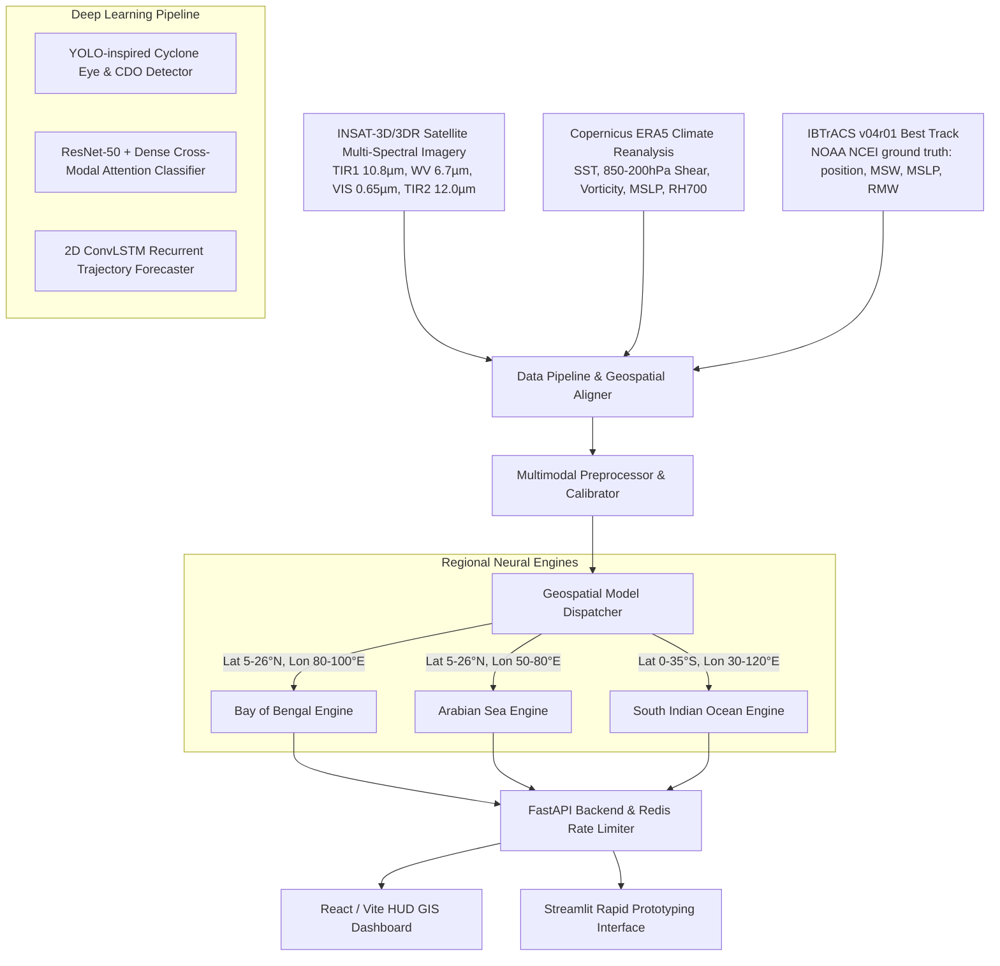

# Tropical Cyclone AI Prediction & Geospatial Tracking System

[](https://fastapi.tiangolo.com)
[](https://pytorch.org)
[](https://onnxruntime.ai)
[](https://reactjs.org)
[](https://www.ncei.noaa.gov/products/international-best-track-archive)
[](LICENSE)

An end-to-end, multimodal deep learning and operational meteorological tracking platform for tropical cyclone **Eye Detection**, **IMD Intensity Scale Classification**, and **48-Hour Spatiotemporal Trajectory Forecasting** across the **Bay of Bengal (BOB)**, **Arabian Sea (ARB)**, and **South Indian Ocean (SIO)**.

---

## Project Status

Read this before quoting any number from this repository.

| Component | Status |
|---|---|
| Data pipeline, preprocessing, geospatial dispatch | Working |
| Model architectures (ResNet-50 fusion, ConvLSTM, eye detector) | Working |
| Training pipeline on real IBTrACS best-track data | Working, verified end-to-end |
| FastAPI backend, Redis limiter, React + Streamlit dashboards | Working |
| Docker orchestration (API + Redis + Triton + trainer) | Working |
| **Trained model weights** | **Not yet produced** |
| **Published accuracy benchmarks** | **None — see [Evaluation](#evaluation)** |

The system runs end-to-end today and the training loop demonstrably learns. It has **not**
yet been trained to convergence, so it currently makes no verified forecasting claim. Train
it yourself with [TRAINING.md](TRAINING.md) — roughly 25 minutes on a single RTX 3060.

---

## System Architecture



---

## Training Data

Supervision comes from **IBTrACS v04r01** (NOAA NCEI) — the authoritative international
best-track archive. Every label is an observation, not a simulation.

Counts below are for seasons 1980–2025 with the six most recent seasons held out:

| Basin | Train samples | Val samples | Storms | Observations |
| :--- | ---: | ---: | ---: | ---: |
| `bay_of_bengal` | 2,182 | 389 | 335 | 4,079 |
| `arabian_sea` | 1,438 | 260 | 202 | 2,519 |
| `indian_ocean_south` | 19,093 | 3,199 | 824 | 26,579 |

One sample is a single 6-hourly forecast instant within a storm: imagery and environment at
time *t*, paired with the observed IMD category, wind, pressure, RMW, and the storm's actual
motion over the next 48 hours.

Two properties worth knowing, because they determine whether the metrics mean anything:

- **The train/val split is by season, not random.** Adjacent 6-hourly observations of the
  same storm are nearly identical; a random split would leak them across the boundary and
  inflate validation scores substantially. The most recent seasons are held out whole.
- **Absent inputs are zeros with a mask, never noise.** Where satellite imagery or an ERA5
  field is unavailable, the input is exactly zero and a companion mask flag records it.
  A zero contributes no gradient; random fill would train the network to read meaning out
  of nothing.

Satellite imagery is optional. **HURSAT-B1** (NOAA NCEI) drops in directly — it is already
cyclone-centered and keyed by IBTrACS storm ID, so it needs no regridding. Without it, the
system trains a legitimate best-track-only baseline and the visual branch stays idle.

---

## Repository Structure

```
cyclone_pred/
│
├── data/
│   ├── raw/
│   │   ├── best_track/                 # IBTrACS CSVs (downloaded, gitignored)
│   │   ├── satellite_imagery/          # INSAT-3D, HURSAT-B1, NASA MODIS raw feeds
│   │   └── climate_reanalysis/         # ERA5 NetCDF/GRIB (SST, wind shear, vorticity)
│   ├── processed/                      # Geographically segregated caches
│   └── annotations/                    # Bounding boxes and IMD intensity labels
│
├── notebooks/
│   ├── 01_satellite_eda.ipynb          # Satellite channel calibration & eye cross-sections
│   ├── 02_multimodal_fusion_experiments.ipynb # ResNet-50 + Dense fusion ablation study
│   └── 03_spatiotemporal_tracking.ipynb       # ConvLSTM 48h trajectory & uncertainty cone
│
├── src/
│   ├── data_pipeline/
│   │   ├── download_ibtracs.py         # IBTrACS best-track downloader (ground truth)
│   │   ├── cyclone_dataset.py          # Supervised Dataset: best-track + HURSAT imagery
│   │   ├── fetch_mosdac_insat.py       # ISRO MOSDAC API integration
│   │   ├── fetch_copernicus_era5.py    # Copernicus CDS API integration
│   │   ├── fetch_nasa_earthdata.py     # NASA CMR API integration
│   │   ├── fetch_openmeteo.py          # Open-Meteo marine/weather API
│   │   ├── spatial_aligner.py          # Aligns 2D pixel grids with 3D weather tensors
│   │   └── preprocessor.py             # Denoising, band stacking, normalization
│   ├── models/
│   │   ├── identification.py           # YOLOv8-inspired object detection model
│   │   ├── classification_fusion.py    # ResNet-50 + Dense multimodal fusion model
│   │   ├── prediction_convlstm.py      # ConvLSTM spatio-temporal trajectory model
│   │   └── model_dispatcher.py         # Dynamic routing logic based on coordinates
│   ├── training/
│   │   ├── train_regional.py           # Per-basin training loop (AMP, Haversine loss)
│   │   ├── export_onnx.py              # PyTorch to ONNX / TensorRT weight exporter
│   │   └── evaluate.py                 # IMD track error & intensity evaluator (see Evaluation)
│   └── utils/
│       ├── gis_visualization.py        # Mapbox/Leaflet vector overlay generators
│       └── imd_metrics.py              # IMD intensity & track error calculators
│
├── checkpoints/                        # Trained weights + per-epoch history (gitignored)
├── triton_model_repository/            # Optimized inference engine directory
│
├── api/
│   ├── main.py                         # FastAPI application entry point
│   ├── inference_router.py             # Model dispatching and payload routing
│   └── rate_limiter.py                 # Redis-backed token bucket middleware
│
├── frontend/
│   ├── src/                            # React dashboard UI (Leaflet map, HUD gauges)
│   │   └── services/api.js             # API connection to FastAPI backend
│   ├── .env                            # VITE_ vars for the browser (gitignored)
│   └── app.py                          # Streamlit interface for fast prototyping
│
├── configs/
│   ├── hyperparams.yaml                # Architectures & training parameters (loaded at train time)
│   └── regional_bounds.json            # Geospatial bounding boxes for model routing
│
├── docker/
│   ├── Dockerfile.api                  # FastAPI backend image
│   ├── Dockerfile.train                # CUDA training image
│   ├── Dockerfile.triton               # Triton inference server image
│   └── docker-compose.yml              # API + Redis + Triton + trainer orchestration
│
├── .env.example                        # Template for secrets — copy to .env
├── .dockerignore
├── TRAINING.md                         # Full training guide
├── requirements.txt
└── README.md
```

---

## IMD Intensity Classification Scale

The platform adheres to the official Indian Meteorological Department categorization. These
thresholds are implemented in `src/data_pipeline/cyclone_dataset.py` and applied directly to
IBTrACS observed wind to derive every training label.

| Code | Intensity Category | Max Sustained Wind (knots) | Max Sustained Wind (km/h) | Central Pressure Drop (hPa) |
| :--- | :--- | :--- | :--- | :--- |
| **D** | Depression | 17 – 27 | 31 – 49 | 1.5 – 3.0 |
| **DD** | Deep Depression | 28 – 33 | 50 – 61 | 3.0 – 4.5 |
| **CS** | Cyclonic Storm | 34 – 47 | 62 – 88 | 4.5 – 8.5 |
| **SCS** | Severe Cyclonic Storm | 48 – 63 | 89 – 117 | 8.5 – 15.5 |
| **VSCS** | Very Severe Cyclonic Storm | 64 – 89 | 118 – 166 | 15.5 – 31.5 |
| **ESCS** | Extremely Severe Cyclonic Storm | 90 – 119 | 167 – 221 | 31.5 – 65.5 |
| **SuCS** | Super Cyclonic Storm | $\ge$ 120 | $\ge$ 222 | $\ge$ 65.6 |

The archive is heavily imbalanced — `D`, `DD` and `CS` are ~80% of Bay of Bengal samples and
`SuCS` is ~0.3% (7 training samples). The trainer applies inverse-frequency class weights to
a focal loss to compensate, but no weighting manufactures examples: **treat any `SuCS` metric
as noise.**

---

## Quickstart

### 1. Installation

```bash
python -m venv venv
source venv/bin/activate          # Windows: venv\Scripts\activate
pip install -r requirements.txt
```

For training, install the CUDA build of PyTorch **first** — `requirements.txt` otherwise
resolves to the CPU wheel and trains roughly 30× slower:

```bash
pip install torch torchvision --index-url https://download.pytorch.org/whl/cu121
```

### 2. Configure secrets

```bash
cp .env.example .env      # then fill in the values
```

Both `.env` and `frontend/.env` are gitignored. Vite only exposes `VITE_`-prefixed variables
to the browser, and only reads them from `frontend/`.

### 3. Download training data

```bash
python -m src.data_pipeline.download_ibtracs
python -m src.data_pipeline.cyclone_dataset --inspect --basin bay_of_bengal
```

The first pulls ~105 MB of best-track CSVs. The second verifies the dataset builds and prints
sample counts, class distribution, and one storm's observed future track.

### 4. Train

```bash
python -m src.training.train_regional --all-basins --device cuda --batch-size 32
```

See **[TRAINING.md](TRAINING.md)** for GPU sizing, satellite imagery ingest, metric
interpretation, and known gaps.

### 5. Export for Triton

```bash
python -m src.training.export_onnx
```

### 6. Launch the backend

```bash
uvicorn api.main:app --host 0.0.0.0 --port 8000 --reload
```

OpenAPI docs at [http://localhost:8000/docs](http://localhost:8000/docs).

### 7. Launch a dashboard

Streamlit — no button to press, move any sidebar slider and the forecast regenerates:

```bash
streamlit run frontend/app.py
```

React + Leaflet — click **Execute Multimodal Forecast**:

```bash
cd frontend && npm install && npm run dev
```

---

## Docker Deployment

Copy `.env.example` to `.env` first — Compose reads it via `env_file`.

```bash
cd docker

docker compose up --build                      # API + Redis
docker compose --profile triton up --build     # + Triton GPU inference server
docker compose --profile train run --rm trainer  # one-off GPU training job
```

The trainer profile accepts the same flags as the CLI:

```bash
docker compose --profile train run --rm trainer --basin arabian_sea --epochs 80
```

Notes on the compose setup:

- `data/` and `checkpoints/` are **bind-mounted, not baked into images** — `.dockerignore`
  excludes them, so the 105 MB best-track archive never enters a build layer.
- Redis is on `expose`, not `ports`. It is reachable from the API and trainer but not
  published to the host; an internet-facing Redis with no auth is a well-known way to lose
  a demo machine.
- The API waits on a Redis healthcheck rather than bare `depends_on`, which only waits for
  container start, not readiness.
- Triton and the trainer need an NVIDIA GPU plus the NVIDIA Container Toolkit. Both sit
  behind profiles so the default `up` works on a CPU-only laptop.

---

## Evaluation

**This project publishes no accuracy benchmarks, because no model has been trained to
convergence yet.**

Earlier revisions of this README quoted figures (12h track error 42.5 km, wind MAE 5.8 kts,
91.5% classification accuracy). Those were not measurements — they were hardcoded fallback
constants inside `evaluate.py`, returned whenever a metric list came back empty, which it
always did. They have been removed and should not be cited.

`src/training/evaluate.py` has **not** yet been ported to the real dataset: it still feeds
`torch.randn` as its satellite input and retains those fallback constants. Rewriting it
against `RealCycloneDataset` is the next task, and until that lands the trustworthy numbers
are the validation metrics the trainer prints each epoch and writes to
`checkpoints/<basin>_history.json`:

- **`track_km`** — mean great-circle error over the forecast horizon. The headline metric,
  and what checkpoint selection optimises.
- **`wind_mae`** — intensity error in knots.
- **`accuracy`** — IMD category accuracy. Always read it against the class distribution.

For calibration when you do have results: IMD's operational 24-hour track error is roughly
80–100 km, and its 24-hour intensity error roughly 10 knots. A first honest training run will
likely land well above both. Report what you measure.

---

## License

MIT License. Built for advanced atmospheric intelligence, early warning dissemination, and
disaster risk reduction.
